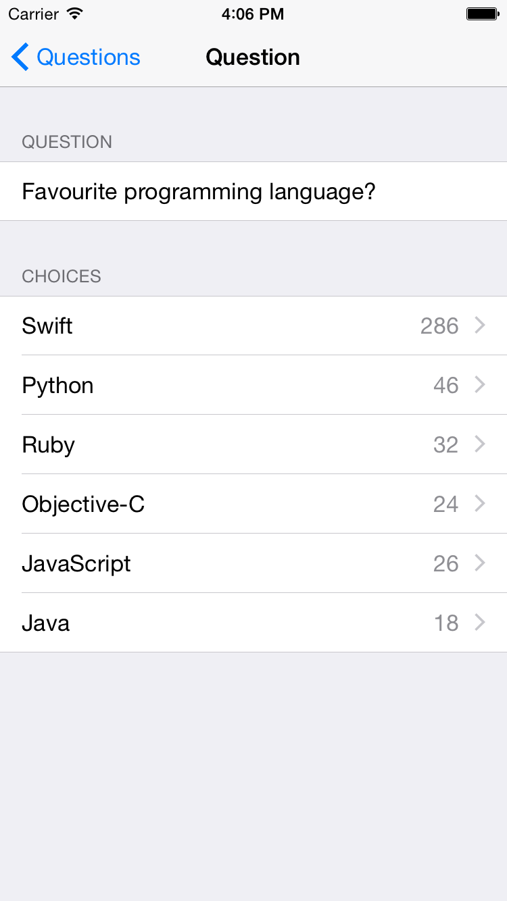

# Polls Client

[](https://circleci.com/gh/apiaryio/polls-app/tree/master)

This is a Swift iPhone and iPad client for the [Polls API](https://github.com/apiaryio/polls-api) - a simple application allowing users to view polls and vote in them.

Polls is an example application utilising the [Hyperdrive](https://github.com/the-hypermedia-project/Hyperdrive) API client. Hyperdrive will communicate to the [Polls API](http://github.com/apiaryio/polls-api) without any hard-coded knowledge about how the API is implemented, just an understanding of the semantics the API is using.

The application does this by learning how the API works at run-time. This can
be achived in one of two ways:

- By downloading the [API specification](apiary.apib) in [API Blueprint](https://apiblueprint.org/) format.
- Talking directly to an API that exposes it's features and transitions in the API, such as with the [Siren](https://github.com/kevinswiber/siren) hypermedia content type.

Both the API and the application support both of these ways, you can switch between these modes in the application settings.



### Quick Start

You will need to [install CocoaPods](http://guides.cocoapods.org/using/getting-started.html) and then run the following steps to checkout the project and install the dependencies.

```
$ git clone https://github.com/apiaryio/polls-app
$ cd polls-app
$ pod install
$ open Polls.xcworkspace
```

### Architecture

This application uses the [MVVM (Model View View-Model)](http://en.wikipedia.org/wiki/Model_View_ViewModel) software architecture. Where each view controller has an appropriate view model which contains all of the model logic. The view model in this case will encapsulate the logic required to communicate to the API.

The Polls application is constructed from three view controllers and view models:

- Question List - Shows a list of questions and may allow the user to create a new question or view the detail of a question.
- Question Detail - Shows a specific question, and may allow a user to vote on the choices available on a question.
- Create Question - Allows the user to create a new question in the API.

#### API Root

The Polls iOS client can be configured to use any API root, or switch
between connecting to a Hypermedia API or the JSON Polls API described
via an API Blueprint. You can switch between these modes by entering the
applications settings.

Defaults:

- Hypermedia: `https://polls.apiblueprint.org/` - A hosted version of a Hypermedia Polls API.
- API Blueprint: `https://raw.githubusercontent.com/apiaryio/polls-app/master/apiary.apib` - An API Blueprint found at this URL (hosted on GitHub in this repository).
- Apiary: `pollsapp` - An API Blueprint hosted on Apiary.

# License

Polls is released under the MIT license. See [LICENSE](LICENSE).

